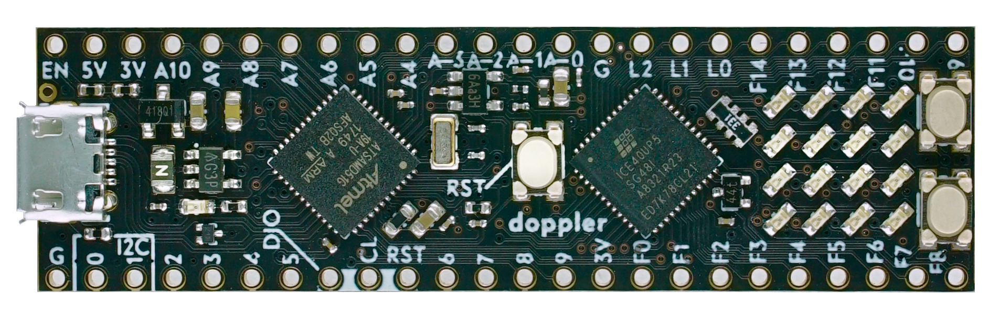

# dadamachines – doppler



The doppler is a Cortex M4F microcontroller + FPGA development board. It comes in the same tiny form factor similar to a [Teensy](https://www.pjrc.com/store/teensy35.html) and is open source. 

## Features
- 120Mhz ARM Cortex M4F MCU 1MB Flash (Microchip ATSAMD51G19A) with FPU
- FPGA 5000 LUT, 1MBit RAM, 6 DSP Cores,OSC, PLL (Lattice ICE40UP5K)
- Arduino IDE compatible
- Breadboard friendly (DIL48)
- Micro USB
- Power over USB or external via pin headers
- VCC 3.5V …. 5.5V 
- All GPIO Pins are 3.3V
- 1 LED connected to SAMD51
- 4 x 4 LED Matrix (connected to FPGA)
- 2 User buttons (connected to FPGA)
- AREF Solder Jumper
- I2C (need external pullup), SPI, QSPI Pins
- 2 DAC pins, 10 ADC pins
- Full open source toolchain
- SWD programming pin headers
- Double press reset to enter the bootloader
- [UF2 Bootloader](https://github.com/Microsoft/uf2-samdx1) with Firmwareupload via simple USB stick mode (Mass Storage Device)

## Getting started with the doppler
We are very excited about FPGA’s but getting started with them is daunting especially because of the ecosystem of proprietary toolchains and expensive hardware. The doppler takes away most of these pains by providing all the tooling to get you up and running.

There are two chips on the board a SAMD51 ARM Microcontroller and an ICE40 FPGA. The microcontroller is easily programmable with, for example, the beginner-friendly Arduino environment. It also needs to be used to upload the configuration as a bitstream to the FPGA. This guide goes in detail on how to set up both development environments for the SAMD51 and the ICE40.

### Set up programming via the Arduino IDE
Please find the instructions in our repository with the dadamachines board support packages for **Arduino**.
[https://github.com/dadamachines/arduino-board-index](https://github.com/dadamachines/arduino-board-index)

### Build the bitstream for the FPGA

1. Install **Docker**.   
On MacOs you can do this easily by running:  
```
brew cask install docker
```  
or just [download it here](https://www.docker.com/products/docker-desktop).

2. Open the **Docker** Application.  
3. Give the **Docker** application the privileges it's asking for.

4. [Download zip](https://github.com/dadamachines/doppler-FPGA-firmware/archive/master.zip) or git clone the **doppler-FPGA-firmware**:  
```
git clone https://github.com/dadamachines/doppler-FPGA-firmware
```
5. Go into the directory you just downloaded.    
```
cd doppler-FPGA-firmware/
```
6. Build the **icestorm** toolchain with **Docker**:  
This will take a while...  
```
docker build -t icestorm  icestorm/
```
7. Set the Mountpoint for **Docker**  
```
export MOUNTPOINT=`pwd`  
docker run -it -v $MOUNTPOINT:/PRJ icestorm bash
```
8. Now we are in the container and can build our bitstream.  
For our **doppler_simple_io** example:    
```
cd PRJ/doppler_simple_io/
make
ls -l
```

### Load the bitstream on the FPGA

	#include <ICEClass.h>
	#include "[PATHTO]/top.bin.h"
	ICEClass ice40;
	 
	void setup() {
	  ice40.upload(top_bin,sizeof(top_bin)); // Upload BitStream Firmware to FPGA -> see variant.h
	  ice40.upload(); // Upload BitStream Firmware to FPGA -> see variant.h
	  ice40.initSPI();  // start SPI runtime Link to FPGA
	}
	
	void loop() {
	   
	  static uint16_t x = 0;
	  ice40.sendSPI16(x++);   delay(50);
	}

### Programming the FPGA
Our language of choice for the FPGA is Verilog

We recommend [this Youtube channel]([https://www.youtube.com/channel/UCsdA-aNqtMA1%5C_2T15aXePWw/videos]) to learn Verilog

[https://www.youtube.com/watch?v=-bIeiMmqaZE](https://www.youtube.com/watch?v=-bIeiMmqaZE)

### Example 1
First try a simple blinking LED bei clk divider in verilog from internal 48mhz osc inside the ice40

### Example 2
next step can be a state machine and 

### Example 3
finaly syncing external clk into local clk domains
keep in mind blocking and nonblocking assignments

### Example 4
Connecting to the SAMD

### DAC/ADC via I2S


